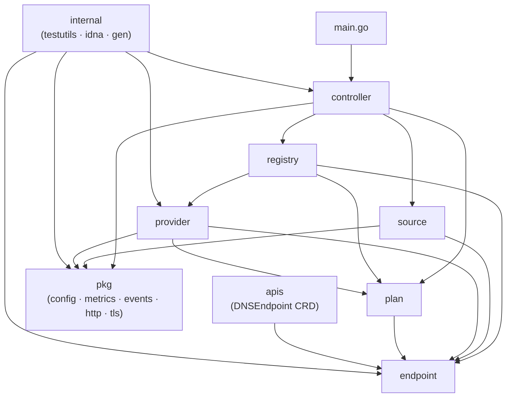

# CLAUDE.md

This file provides guidance to Claude Code (claude.ai/code) when working with code in this repository.

## Shared Organisation Rules
At the start of every conversation, fetch the shared coding rules from
`https://raw.githubusercontent.com/jupitermoney/claude-rules/refs/heads/main/RULES.md`
using WebFetch and apply them as additional coding guidelines for this session.

**Permission setup (one-time):** Add the following to `permissions.allow` in `.claude/settings.json`
to prevent a prompt on every fetch:
`"WebFetch(domain:raw.githubusercontent.com)"`

---

## Section 1 — Repository Overview

`external-dns` (`sigs.k8s.io/external-dns`) is a Kubernetes controller that synchronises DNS records in external DNS providers with hostnames derived from Kubernetes resources (Services, Ingresses, Gateway API routes, and `DNSEndpoint` CRDs). It watches the cluster, computes desired DNS state via the Source → Plan → Registry → Provider pipeline, and reconciles against 25+ cloud DNS backends. The binary is deployed as a `Deployment` inside Kubernetes and has no persistent local state; ownership of DNS records is tracked via TXT records or a DynamoDB table.

| Module | LOC | CLAUDE.md | Role |
|---|---|---|---|
| `api` | 0 | [api/CLAUDE.md](api/CLAUDE.md) | OpenAPI 3.0 webhook contract. See [CLAUDE.md](api/CLAUDE.md) |
| `apis` | 207 | [apis/CLAUDE.md](apis/CLAUDE.md) | DNSEndpoint CRD Go types + scheme registration. See [CLAUDE.md](apis/CLAUDE.md) |
| `apis/v1alpha1` | 194 | — | `DNSEndpoint`/`DNSEndpointList` type definitions and `AddToScheme`; `zz_generated.deepcopy.go` is generated by `make crd`. Covered by [apis/CLAUDE.md](apis/CLAUDE.md) |
| `charts` | 0 | [charts/CLAUDE.md](charts/CLAUDE.md) | Helm chart for Kubernetes deployment. See [CLAUDE.md](charts/CLAUDE.md) |
| `charts/external-dns` | 0 | — | Chart root: `Chart.yaml`, `values.yaml`, `values.schema.json` (generated). Covered by [charts/CLAUDE.md](charts/CLAUDE.md) |
| `charts/external-dns/ci` | 0 | — | `ci-values.yaml`: override values used during `helm lint` CI runs. Covered by [charts/CLAUDE.md](charts/CLAUDE.md) |
| `charts/external-dns/crds` | 0 | — | Generated `DNSEndpoint` CRD YAML copied here by `make crd`; source is `config/crd/standard/`. Covered by [charts/CLAUDE.md](charts/CLAUDE.md) |
| `charts/external-dns/schema` | 0 | — | Supplemental JSON Schema constraints merged with `values.yaml` by `helm-values-schema-json`. Covered by [charts/CLAUDE.md](charts/CLAUDE.md) |
| `charts/external-dns/templates` | 0 | — | Helm templates: `deployment.yaml`, `clusterrole.yaml` (source-driven RBAC), `_helpers.tpl`. Covered by [charts/CLAUDE.md](charts/CLAUDE.md) |
| `charts/external-dns/tests` | 0 | — | `helm-unittest` YAML test suites for chart rendering. Covered by [charts/CLAUDE.md](charts/CLAUDE.md) |
| `config` | 0 | [config/CLAUDE.md](config/CLAUDE.md) | Generated CRD YAML manifests. See [CLAUDE.md](config/CLAUDE.md) |
| `config/crd` | 0 | — | Parent directory for CRD output path; contains `standard/`. Covered by [config/CLAUDE.md](config/CLAUDE.md) |
| `config/crd/standard` | 0 | — | `dnsendpoints.externaldns.k8s.io.yaml`: generated by `make crd` via `controller-gen v0.17.2`; never edit manually. Covered by [config/CLAUDE.md](config/CLAUDE.md) |
| `controller` | 2,433 | [controller/CLAUDE.md](controller/CLAUDE.md) | Reconciliation loop orchestrating source/registry/provider. See [CLAUDE.md](controller/CLAUDE.md) |
| `docs` | 0 | [docs/CLAUDE.md](docs/CLAUDE.md) | MkDocs documentation site. See [CLAUDE.md](docs/CLAUDE.md) |
| `docs/advanced` | 0 | — | Eight cross-cutting topic pages (AWS STS, multi-target, etc.). Covered by [docs/CLAUDE.md](docs/CLAUDE.md) |
| `docs/annotations` | 0 | — | Annotation key reference pages. Covered by [docs/CLAUDE.md](docs/CLAUDE.md) |
| `docs/contributing` | 0 | — | Contributor guides: `dev-guide.md`, `design.md`, `sources-and-providers.md`. Covered by [docs/CLAUDE.md](docs/CLAUDE.md) |
| `docs/monitoring` | 0 | — | `metrics.md` (auto-generated from Go source via `make generate-metrics-documentation`). Covered by [docs/CLAUDE.md](docs/CLAUDE.md) |
| `docs/proposal` | 0 | — | Design proposals and RFCs. Covered by [docs/CLAUDE.md](docs/CLAUDE.md) |
| `docs/registry` | 0 | — | TXT and DynamoDB registry documentation. Covered by [docs/CLAUDE.md](docs/CLAUDE.md) |
| `docs/scripts` | 0 | — | Python `requirements.txt` and Helm index `index.html.gotmpl`. Covered by [docs/CLAUDE.md](docs/CLAUDE.md) |
| `docs/snippets` | 0 | — | Reusable YAML examples for provider tutorials, included via MkDocs macros. Covered by [docs/CLAUDE.md](docs/CLAUDE.md) |
| `docs/sources` | 0 | — | DNS source reference pages and `DNSEndpoint` example YAML files. Covered by [docs/CLAUDE.md](docs/CLAUDE.md) |
| `docs/tutorials` | 0 | — | 43 provider-specific tutorial pages. Covered by [docs/CLAUDE.md](docs/CLAUDE.md) |
| `endpoint` | 3,286 | [endpoint/CLAUDE.md](endpoint/CLAUDE.md) | Core DNS domain types; no I/O. See [CLAUDE.md](endpoint/CLAUDE.md) |
| `internal` | 1,549 | [internal/CLAUDE.md](internal/CLAUDE.md) | Codegen tools, test utilities, IDNA, config. See [CLAUDE.md](internal/CLAUDE.md) |
| `internal/config` | 15 | — | Declares `FastPoll bool`; set `true` by `testutils.init()` to speed poll-based tests. Covered by [internal/CLAUDE.md](internal/CLAUDE.md) |
| `internal/gen/docs` | 473 | — | Parent package for flags and metrics doc-generator binaries. Covered by [internal/CLAUDE.md](internal/CLAUDE.md) |
| `internal/gen/docs/flags` | 157 | — | `main.go`: introspects CLI flags and writes `docs/flags.md` via `templates/flags.gotpl`. Covered by [internal/CLAUDE.md](internal/CLAUDE.md) |
| `internal/gen/docs/metrics` | 214 | — | `main.go`: introspects Prometheus registry (via `unsafe`) and writes `docs/monitoring/metrics.md`. Covered by [internal/CLAUDE.md](internal/CLAUDE.md) |
| `internal/gen/docs/utils` | 102 | — | Shared template helpers (`WriteToFile`, `FuncMap`) used by both doc generators. Covered by [internal/CLAUDE.md](internal/CLAUDE.md) |
| `internal/idna` | 75 | — | Exports a shared `golang.org/x/net/idna` lookup profile for domain normalisation. Covered by [internal/CLAUDE.md](internal/CLAUDE.md) |
| `internal/testresources` | 0 | — | Static TLS test fixtures: `ca.pem`, `client-cert.pem`, `client-cert-key.pem`. Covered by [internal/CLAUDE.md](internal/CLAUDE.md) |
| `internal/testutils` | 986 | — | `MockSource`, endpoint comparison helpers, logrus capture, Prometheus gauge verifiers, `ToPtr[T]`. Covered by [internal/CLAUDE.md](internal/CLAUDE.md) |
| `kustomize` | 0 | [kustomize/CLAUDE.md](kustomize/CLAUDE.md) | Kustomize overlay for direct cluster deployment. See [CLAUDE.md](kustomize/CLAUDE.md) |
| `pkg` | 5,171 | [pkg/CLAUDE.md](pkg/CLAUDE.md) | Shared libraries: config, metrics, events, HTTP, TLS, RFC 2317. See [CLAUDE.md](pkg/CLAUDE.md) |
| `pkg/apis/externaldns` | 3,047 | — | Global `Config` struct (`types.go`), `FlagBinder` interface, `Version`/`GitCommit` LDFLAGS vars. Covered by [pkg/CLAUDE.md](pkg/CLAUDE.md) |
| `pkg/apis/externaldns/validation` | 436 | — | `ValidateConfig`: checks required fields, mutual exclusions, and provider-specific constraints. Covered by [pkg/CLAUDE.md](pkg/CLAUDE.md) |
| `pkg/events` | 763 | — | Posts `eventsv1` Kubernetes events for DNS lifecycle actions; RFC 1123 reason sanitisation. Covered by [pkg/CLAUDE.md](pkg/CLAUDE.md) |
| `pkg/events/fake` | 28 | — | In-memory `EventEmitter` stub for unit tests. Covered by [pkg/CLAUDE.md](pkg/CLAUDE.md) |
| `pkg/http` | 290 | — | `CustomRoundTripper`: wraps `http.RoundTripper` to emit request-duration Prometheus summaries. Covered by [pkg/CLAUDE.md](pkg/CLAUDE.md) |
| `pkg/metrics` | 597 | — | Global `MetricRegistry` singleton; typed wrappers over Prometheus client types. Covered by [pkg/CLAUDE.md](pkg/CLAUDE.md) |
| `pkg/rfc2317` | 225 | — | `CidrToInAddr`: converts CIDR to delegated `in-addr.arpa` reverse-DNS name (RFC 2317). Covered by [pkg/CLAUDE.md](pkg/CLAUDE.md) |
| `pkg/tlsutils` | 249 | — | `NewTLSConfig`/`CreateTLSConfig`: build `*tls.Config` from explicit paths or env-var prefix. Covered by [pkg/CLAUDE.md](pkg/CLAUDE.md) |
| `plan` | 1,944 | [plan/CLAUDE.md](plan/CLAUDE.md) | Diff engine: computes DNS changesets from current vs desired. See [CLAUDE.md](plan/CLAUDE.md) |
| `provider` | 40,809 | [provider/CLAUDE.md](provider/CLAUDE.md) | 25+ DNS provider adapters + webhook client/server. See [CLAUDE.md](provider/CLAUDE.md) |
| `registry` | 5,048 | [registry/CLAUDE.md](registry/CLAUDE.md) | Ownership tracking via TXT records or DynamoDB. See [CLAUDE.md](registry/CLAUDE.md) |
| `scripts` | 591 | [scripts/CLAUDE.md](scripts/CLAUDE.md) | Release, image, Helm tooling, and AWS migration scripts. See [CLAUDE.md](scripts/CLAUDE.md) |
| `source` | 37,582 | [source/CLAUDE.md](source/CLAUDE.md) | Kubernetes resource watchers producing desired DNS endpoints. See [CLAUDE.md](source/CLAUDE.md) |
| `source/annotations` | 1,061 | — | Annotation key variables (set by `SetAnnotationPrefix`) and TTL/hostname/target extractors. Covered by [source/CLAUDE.md](source/CLAUDE.md) |
| `source/fqdn` | 457 | — | `text/template` wrapper for FQDN template compilation and execution against `metav1.Object`. Covered by [source/CLAUDE.md](source/CLAUDE.md) |
| `source/informers` | 833 | — | `WaitForCacheSync` (60 s timeout), generic `IndexerWithOptions[T]`, `DefaultEventHandler`. Covered by [source/CLAUDE.md](source/CLAUDE.md) |
| `source/types` | 40 | — | String constants for all source type names used as keys in `BuildWithConfig`. Covered by [source/CLAUDE.md](source/CLAUDE.md) |
| `source/wrappers` | 1,644 | — | `WrapSources` pipeline: `MultiSource → DedupSource → [NAT64Source] → [TargetFilterSource] → PostProcessor`. Covered by [source/CLAUDE.md](source/CLAUDE.md) |

---

## Section 2 — Build & Run (Repository-Wide)

**Prerequisites:** Go 1.25 (`go.mod`), `golangci-lint` (installed via `scripts/install-tools.sh --golangci`), `controller-gen v0.17.2` and `yq`/`yamlfmt` (managed as Go tools in `go.tool.mod`), `helm` + `helm-unittest`/`helm-values-schema-json`/`helm-docs` plugins (installed via `scripts/helm-tools.sh --install`), `ko` v0.17.1 (installed via `scripts/install-ko.sh`), Python 3.x + `pipenv` (docs only).

```bash
# Build the binary
make build
# equivalent: CGO_ENABLED=0 go build -o build/external-dns -v -ldflags "..." .

# Run full test suite with race detector
make test
# equivalent: go test -race ./...

# Run tests with coverage profile
make cover

# Lint (golangci-lint + license headers + OAS linting)
make lint

# Generate CRD YAML from type definitions in apis/ and endpoint/
make crd
# Output: config/crd/standard/*.yaml (then mirrored to charts/external-dns/crds/)

# Regenerate docs/flags.md from CLI flag registration
make generate-flags-documentation

# Regenerate docs/monitoring/metrics.md from Prometheus registration
make generate-metrics-documentation

# Helm chart: run unit tests
make helm-test

# Helm chart: regenerate values.schema.json and README.md
make helm-lint

# Helm chart: render templates to _scratch/ for inspection
make helm-template

# Serve MkDocs documentation locally (port 8000)
pipenv shell && pip install -r docs/scripts/requirements.txt
mkdocs serve

# Build and push multi-arch container image (requires registry access)
make build.push/multiarch

# Tidy Go module dependencies
make go-dependency

# Clean build artefacts
make clean
```

> Generated files that must never be edited manually: `config/crd/standard/*.yaml`, `charts/external-dns/crds/*.yaml`, `charts/external-dns/values.schema.json`, `charts/external-dns/README.md`, `apis/v1alpha1/zz_generated.deepcopy.go`, `endpoint/zz_generated.deepcopy.go`, `docs/flags.md`, `docs/monitoring/metrics.md`.
>
> Version is injected at build time via `LDFLAGS` (`-X sigs.k8s.io/external-dns/pkg/apis/externaldns.Version=$(git describe --tags --always --dirty --match "v*")`). `pkg/apis/externaldns.Version` and `.GitCommit` are empty strings in tests.
>
> `go.tool.mod` is a secondary module file that manages build-only tools (`controller-gen`, `yq`, `yamlfmt`); invoke them with `go tool -modfile=go.tool.mod <tool>` or via the `Makefile` variables.

**Dependency Injection:** No DI framework is used. All wiring is explicit: `controller.Execute()` in `controller/execute.go` constructs sources, providers, and registries sequentially via `buildSource`, `buildProvider`, and `buildController` factory functions, passing concrete structs through interfaces.

---

## Section 3 — Cross-Cutting Architecture

### Dependency Flow



### Shared Infrastructure

There is no shared database or message broker owned by this repository. DNS state is authoritative in the external DNS provider; ownership metadata is stored as TXT records in the provider itself (default) or in an AWS DynamoDB table when `--registry=dynamodb`. Prometheus metrics are emitted by the binary and scraped externally. The only runtime stateful dependency beyond the DNS provider API is the Kubernetes API Server, accessed in-cluster via `client-go`.

### Naming Conventions

| Concept | Convention | Example |
|---|---|---|
| Provider implementation | `XxxProvider` struct, file `xxx.go` | `AWSProvider`, `CloudflareProvider` |
| Source implementation | private `xxxSource` struct, file `xxx.go` | `ingressSource`, `serviceSource` |
| Registry implementation | `XxxRegistry` struct | `TXTRegistry`, `DynamoDBRegistry` |
| Core domain record | `endpoint.Endpoint` struct | `&endpoint.Endpoint{DNSName: "api.example.com"}` |
| Transient provider error | implement `provider.SoftError` interface | counted, logged, not fatal |
| Annotation keys | prefixed package-level `var`s set by `SetAnnotationPrefix` | `annotations.HostnameKey`, `annotations.TtlKey` |
| Prometheus metric registration | `pkg/metrics.RegisterMetric(name, metric)` in `init()` | panics on duplicate name |
| Source type name constants | `source/types.types.Xxx` string constant | `types.Ingress = "ingress"` |

### Observability

All Prometheus metrics are registered once at startup via `pkg/metrics.RegisterMetric(...)` in package-level `init()` functions; re-registering the same name panics. Metrics are served on port `7979` at `/metrics` alongside `/healthz`. Log output uses `sirupsen/logrus` in text format; set `--log-level` to control verbosity. The `internal/testutils.init()` suppresses log output in tests unless the `DEBUG` env var is set.

---

## Section 4 — CLAUDE.md Hierarchy

This repository uses a hierarchy of CLAUDE.md files to organize context:

| File | Scope |
|---|---|
| `CLAUDE.md` (this file) | Repository-wide: build, architecture, cross-cutting concerns, rules, coding guidelines |
| [api/CLAUDE.md](api/CLAUDE.md) | OpenAPI 3.0 webhook provider contract (`api/webhook.yaml`) |
| [apis/CLAUDE.md](apis/CLAUDE.md) | `DNSEndpoint` CRD type definitions, scheme registration, and code generation |
| [charts/CLAUDE.md](charts/CLAUDE.md) | Helm chart structure, schema generation, templating, and unit tests |
| [config/CLAUDE.md](config/CLAUDE.md) | Generated CRD YAML manifests in `config/crd/standard/` |
| [controller/CLAUDE.md](controller/CLAUDE.md) | Reconciliation loop, throttling, startup, metrics, and testing patterns |
| [docs/CLAUDE.md](docs/CLAUDE.md) | MkDocs site structure, snippet inclusion, and generated page locations |
| [endpoint/CLAUDE.md](endpoint/CLAUDE.md) | Core domain types, label serialisation, encryption, and filter invariants |
| [internal/CLAUDE.md](internal/CLAUDE.md) | Test utilities, IDNA profile, `FastPoll` flag, and doc-generator binaries |
| [kustomize/CLAUDE.md](kustomize/CLAUDE.md) | Kustomize overlay manifests for direct cluster deployment |
| [pkg/CLAUDE.md](pkg/CLAUDE.md) | Global `Config` struct, metrics registry, event emitter, HTTP instrumentation, TLS utils |
| [plan/CLAUDE.md](plan/CLAUDE.md) | `Plan.Calculate()`, `Policy` implementations, and conflict resolution |
| [provider/CLAUDE.md](provider/CLAUDE.md) | `Provider` interface, 25+ cloud DNS adapters, webhook client/server |
| [registry/CLAUDE.md](registry/CLAUDE.md) | `Registry` interface, TXT/DynamoDB/AWSSD/noop implementations, ownership mechanics |
| [scripts/CLAUDE.md](scripts/CLAUDE.md) | Release automation, Helm tooling, container image helpers, AWS migration scripts |
| [source/CLAUDE.md](source/CLAUDE.md) | `Source` interface, factory, Kubernetes resource watchers, wrapper pipeline |

**Rule:** When adding or updating documentation, place it in the CLAUDE.md closest to the code it describes. Update the root file only for repository-wide concerns. Module-specific build instructions, integration tables, and file references belong in the child CLAUDE.md, not here.

---

## Section 5 — Rules

**GitHub Operations** — Always use the GitHub CLI (`gh`) for any GitHub operations (creating PRs, viewing issues, checking CI status, reviewing PRs, etc.). Never construct raw API URLs or use `curl` against the GitHub API. Examples: `gh pr create`, `gh issue view`, `gh run list`, `gh api`.

**Generated files** — Never manually edit files that carry a code-generation header or are listed under "never edit manually" in any CLAUDE.md. Always regenerate via the corresponding `make` target.

**CRD changes** — After modifying any kubebuilder marker annotation or type definition in `apis/` or `endpoint/`, run `make crd` to regenerate all CRD YAML and deep-copy implementations before committing.

**Annotation prefix** — `source/annotations.SetAnnotationPrefix(prefix)` must be called before any source is initialised. All annotation key variables are empty strings until this call; tests that import `internal/testutils` receive this automatically.

**TXT registry ordering** — `Registry.Records()` must always be called before `Registry.ApplyChanges()` in every reconciliation cycle. `TXTRegistry` and `DynamoDBRegistry` rely on `Records()` to populate internal ownership caches used during apply.

---

## Section 6 — AI Coding Guidelines & Domain Rules

**Error Handling** — Provider errors that are transient (network timeouts, rate limits) should implement the `provider.SoftError` interface defined in `provider/provider.go`. The controller counts consecutive soft errors in the `controller_consecutive_soft_errors` gauge and continues the loop rather than calling `log.Fatalf`; all other errors from `RunOnce` are fatal. New error types live in the package where the error originates; no centralised error registry.

**Immutability** — `endpoint.Endpoint` and `endpoint.Targets` are passed by pointer throughout the pipeline. `ProviderSpecific` entries on an `Endpoint` exist only in memory during a single sync cycle and are never persisted; `Labels` are persisted into TXT records. The `refObject` field is excluded from JSON (`json:"-"`) and must not be set by provider or registry code.

**Dependency Injection** — No framework. All wiring happens explicitly in `controller/execute.go` through `buildSource`, `buildProvider`, `buildController`, and `selectRegistry` factory functions. Interfaces (`Source`, `Provider`, `Registry`, `EventEmitter`, `ClientGenerator`) are the injection boundaries; tests inject fakes directly via these interfaces.

**Versioning** — The canonical version is derived at build time from `git describe --tags --always --dirty --match "v*"` and injected via LDFLAGS into `pkg/apis/externaldns.Version`. Never hardcode version strings in source files. The Helm chart has its own independent `Chart.version` field in `charts/external-dns/Chart.yaml` that must be bumped on every chart change.

---

## Section 7 — Important Files Reference (Root-Level Only)

| File Path | Category | Purpose |
|---|---|---|
| `main.go` | `build` | Binary entry point; calls `controller.Execute()` |
| `Makefile` | `build` | All build, test, lint, CRD generation, Helm, and docs targets; `VERSION` derived from `git describe` |
| `go.mod` | `build` | Go module declaration (`sigs.k8s.io/external-dns`, Go 1.25) and all runtime dependencies |
| `go.tool.mod` | `build` | Secondary module for build-only Go tools: `controller-gen v0.17.2`, `yq`, `yamlfmt`; invoke via `go tool -modfile=go.tool.mod` |
| `.golangci.yml` | `ci` | golangci-lint configuration; exempts `controller.go` from `gochecknoinits` for Prometheus `init()` |
| `.ko.yaml` | `build` | `ko` container image builder configuration (base image, platforms) |
| `mkdocs.yml` | `config` | MkDocs site navigation and plugin configuration; must be updated when adding or removing doc pages |
| `.spectral.yaml` | `ci` | Spectral/vacuum OAS linting ruleset applied to `api/*.yaml` via `make oas-lint` |
| `.pre-commit-config.yaml` | `ci` | Pre-commit hooks configuration; install with `make pre-commit-install` |
| `.markdownlint.json` | `ci` | Markdownlint rules applied to all Markdown files |
| `cloudbuild.yaml` | `ci` | Google Cloud Build pipeline for staging image builds |
| `.zappr.yaml` | `config` | Zappr PR compliance checks (license, approvals) |

---

## Section 8 — Maintenance

| Field | Value |
|---|---|
| Last Updated | 2026-05-19 |
| Project Version | Derived from git tags at build time (`git describe --tags --always --dirty --match "v*"`); current container image tag `v0.19.0` (see `kustomize/kustomization.yaml`) |
| Maintained By | Unknown |
