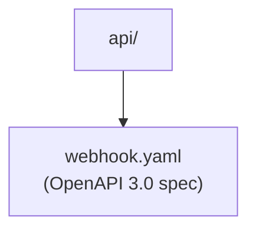

# CLAUDE.md

This file provides guidance to Claude Code (claude.ai/code) when working with code in this repository.

## Section 1 — Local Setup, Build & Startup

This module is built and run as part of the parent project. See the root `CLAUDE.md` for repository-wide build and run instructions.

---

## Section 2 — Module Topology & Architecture

This directory contains no Go source code and has no sibling module dependencies. It is a specification-only directory.

---

## Section 3 — Integrations & Network Topology *(MCP-parseable — strict tables required)*

### A. Core Infrastructure

| System | Protocol | Role |
|---|---|---|
| *(none)* | — | This directory contains only an API specification; it has no stateful infrastructure dependencies. |

### B. Downstream Services — APIs We Consume

No direct external service integrations. All downstream calls are routed through intra-repo service modules.

### C. Exposed Interfaces — APIs We Provide

#### Webhook Provider Interface (OpenAPI 3.0 specification)

Defines the contract that any out-of-tree webhook DNS provider must implement to be driven by ExternalDNS. All request and response bodies use content type `application/external.dns.webhook+json;version=1`.

> Spec: `api/webhook.yaml`

| Path | Description |
|---|---|
| `GET /` | Initialization — negotiates content-type headers and returns the provider's domain filter list |
| `GET /records` | Returns all current DNS records held by the provider |
| `POST /records` | Applies a changeset (create / updateOld+updateNew / delete endpoint lists) |
| `POST /adjustendpoints` | Transforms a list of desired endpoints before they are applied (provider-side normalization) |

---

## Section 4 — Important Files Reference

| File Path | Category | Purpose |
|---|---|---|
| `api/webhook.yaml` | `spec` | OpenAPI 3.0 specification (version v0.15.0) defining the full webhook provider contract including all path operations and the `endpoint`, `endpoints`, `filters`, `changes`, and `providerSpecificProperty` schemas |

---

## Section 5 — Maintenance

| Field | Value |
|---|---|
| Last Updated | 2026-05-19 |
| Project Version | v0.15.0 (from `info.version` in `api/webhook.yaml`) |
| Maintained By | Unknown |
