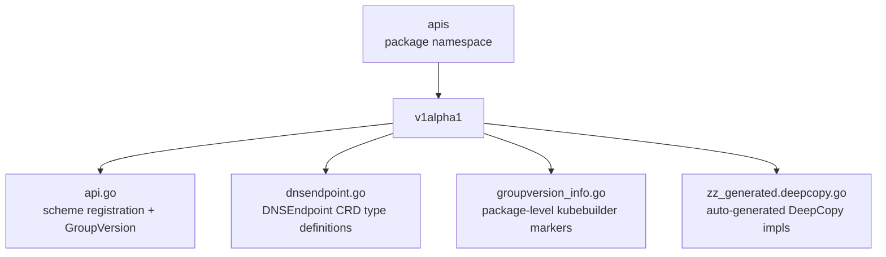

# CLAUDE.md

This file provides guidance to Claude Code (claude.ai/code) when working with code in this repository.

## Section 1 — Local Setup, Build & Startup

This module is built and run as part of the parent project. See the root `CLAUDE.md` for repository-wide build and run instructions.

**Code generation:** `make crd` (run from the repository root) regenerates `v1alpha1/zz_generated.deepcopy.go` and the CRD YAML manifests by invoking `controller-gen` against `./apis/...`. Re-run this after modifying any kubebuilder marker annotations or type definitions in this directory.

## Section 2 — Module Topology & Architecture

Depends on: `endpoint` (intra-repo sibling package — named as an opaque dependency only)

## Section 3 — Integrations & Network Topology

### A. Core Infrastructure

| System | Protocol | Role |
|--------|----------|------|
| Kubernetes API Server | CRD registration | Registers `DNSEndpoint`/`DNSEndpointList` under `externaldns.k8s.io/v1alpha1` via `AddToScheme`; no runtime I/O originates from this module |

### B. Downstream Services — APIs We Consume

No direct external service integrations. All downstream calls are routed through intra-repo service modules.

### C. Exposed Interfaces — APIs We Provide

#### DNSEndpoint (Kubernetes CRD — `externaldns.k8s.io/v1alpha1`)

Defines the `DNSEndpoint` custom resource that users install in their clusters to declare desired DNS records. Carries a `status` subresource tracking `observedGeneration`.

> Spec: `apis/v1alpha1/dnsendpoint.go`

## Section 4 — Important Files Reference

| File Path | Category | Purpose |
|-----------|----------|---------|
| `apis/api.go` | `entrypoint` | Top-level `apis` package namespace declaration; no symbols exported |
| `apis/OWNERS` | `build` | OWNERS governance file; labels this directory as `apis` for triage |
| `apis/v1alpha1/api.go` | `entrypoint` | Declares `GroupVersion` (`externaldns.k8s.io/v1alpha1`), `SchemeBuilder`, and `AddToScheme`; `init()` registers `DNSEndpoint` and `DNSEndpointList` with the scheme |
| `apis/v1alpha1/dnsendpoint.go` | `schema` | Defines `DNSEndpoint`, `DNSEndpointList`, `DNSEndpointSpec`, and `DNSEndpointStatus`; all kubebuilder marker annotations live here |
| `apis/v1alpha1/groupversion_info.go` | `schema` | Package-level `+kubebuilder:object:generate=true` and `+groupName=externaldns.k8s.io` markers; no exported symbols |
| `apis/v1alpha1/zz_generated.deepcopy.go` | `build` | Auto-generated `DeepCopyObject`/`DeepCopyInto` implementations — **never edit manually**; regenerate with `make crd` from the repository root |

## Section 5 — Maintenance

| Field | Value |
|-------|-------|
| Last Updated | 2026-05-19 |
| Project Version | N/A — Go module; versioned via VCS tags (no `gradle.properties`, `build.gradle.kts`, or `package.json` present) |
| Maintained By | Unknown |
