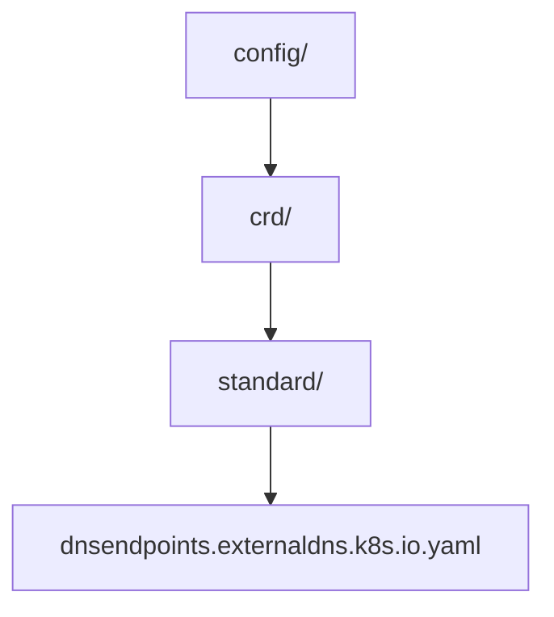

# CLAUDE.md

This file provides guidance to Claude Code (claude.ai/code) when working with code in this repository.

---

## Section 1 — Local Setup, Build & Startup

This module is built and run as part of the parent project. See the root `CLAUDE.md` for repository-wide build and run instructions.

---

## Section 2 — Module Topology & Architecture

This directory has no sibling module dependencies — it contains a single static YAML artifact.

The CRD schema is generated from source type definitions in `./apis/...` (opaque to this module). The regeneration pipeline is defined in the root `Makefile` (`make crd` target) and uses `controller-gen v0.17.2`. After regeneration, the output is also mirrored to `./charts/external-dns/crds/` by the same target.

> **Do not edit `config/crd/standard/*.yaml` manually.** These files are fully generated; manual edits will be overwritten by the next `make crd` invocation.

---

## Section 3 — Integrations & Network Topology

#### A. Core Infrastructure

| System | Protocol | Role |
|--------|----------|------|
| Kubernetes API Server | Kubernetes API (CRD registration) | Declares the `DNSEndpoint` custom resource type in the `externaldns.k8s.io` group so clusters can store `DNSEndpoint` objects |

#### B. Downstream Services — APIs We Consume

No direct external service integrations. All downstream calls are routed through intra-repo service modules.

#### C. Exposed Interfaces — APIs We Provide

#### DNSEndpoint CRD (`externaldns.k8s.io/v1alpha1`)

Defines the `DNSEndpoint` namespaced custom resource. Users and controllers create `DNSEndpoint` objects in a cluster to declare DNS records that external-dns should reconcile against a DNS provider.

> Spec: `config/crd/standard/dnsendpoints.externaldns.k8s.io.yaml`

| Path | Description |
|------|-------------|
| N/A  | CRD exposes no HTTP endpoints; it registers a Kubernetes resource type only |

---

## Section 4 — Important Files Reference

| File Path | Category | Purpose |
|-----------|----------|---------|
| `config/crd/standard/dnsendpoints.externaldns.k8s.io.yaml` | `spec` | Generated CRD manifest for the `DNSEndpoint` resource (`externaldns.k8s.io/v1alpha1`); produced by `make crd` via `controller-gen v0.17.2` from `./apis/...` |

---

## Section 5 — Maintenance

| Field | Value |
|-------|-------|
| Last Updated | 2026-05-19 |
| Project Version | Derived from git tags at build time (`git describe --tags --always --dirty --match "v*"`) |
| Maintained By | Unknown |
