# CLAUDE.md

This file provides guidance to Claude Code (claude.ai/code) when working with code in this repository.

## Section 1 — Local Setup, Build & Startup

The `docs` directory is a MkDocs documentation site that can be served independently.

**Prerequisites:** Python 3.x, [pipenv](https://pipenv.pypa.io)

```bash
# Install Python dependencies into a virtual environment (one-time setup)
pipenv shell
pip install -r docs/scripts/requirements.txt

# Serve documentation locally with hot-reload
mkdocs serve
# Served at http://127.0.0.1:8000/

# Regenerate docs/flags.md from Go source (run from repo root)
make generate-flags-documentation

# Regenerate docs/monitoring/metrics.md from Go source (run from repo root)
make generate-metrics-documentation
```

> `docs/flags.md` and `docs/monitoring/metrics.md` are auto-generated — never edit these files manually.
> When adding or removing a documentation page, the site navigation configuration at the repository root must also be updated.

No startup sequence — `mkdocs serve` launches the development server directly with no application boot steps.

---

## Section 2 — Module Topology & Architecture

```mermaid
graph TD
    docs --> advanced["advanced/ — 8 cross-cutting topic pages"]
    docs --> annotations["annotations/ — annotation reference"]
    docs --> contributing["contributing/ — contributor guides and architecture docs"]
    docs --> monitoring["monitoring/ — metrics reference (metrics.md is auto-generated)"]
    docs --> overrides["overrides/ — Material theme HTML partials"]
    docs --> proposal["proposal/ — design proposals and RFCs"]
    docs --> registry["registry/ — TXT and DynamoDB registry docs"]
    docs --> scripts["scripts/ — Python requirements and Helm index template"]
    docs --> snippets["snippets/ — reusable provider YAML examples"]
    docs --> sources["sources/ — DNS source reference pages and CRD example YAMLs"]
    docs --> tutorials["tutorials/ — 43 provider-specific tutorial pages"]
```



Depends on: root repository build system (for `generate-flags-documentation` and `generate-metrics-documentation` targets only).

**Snippet inclusion pattern:** The MkDocs `macros` plugin serves files from `docs/snippets/` into Markdown pages. The project uses non-default Jinja2 delimiters — `[[ ]]` for variables and `[[% %]]` for blocks — because the default `{{ }}` conflicts with Kubernetes YAML. Reference a snippet from a `.md` file like:

````md
```yaml
[[% include 'snippets/provider/file.yaml' %]]
```
````

---

## Section 3 — Integrations & Network Topology

### A. Core Infrastructure

| System | Protocol | Role |
|---|---|---|
| MkDocs dev server | HTTP | Renders and serves documentation at `127.0.0.1:8000` during local development |

### B. Downstream Services — APIs We Consume

No direct external service integrations. All downstream calls are routed through intra-repo service modules.

### C. Exposed Interfaces — APIs We Provide

This module exposes no gRPC servers or REST controllers. The MkDocs development server is a local-only tool.

| Path | Description |
|---|---|
| `http://127.0.0.1:8000/` | MkDocs dev server — local development only |

---

## Section 4 — Important Files Reference

| File Path | Category | Purpose |
|---|---|---|
| `docs/scripts/requirements.txt` | `build` | Pinned Python packages for MkDocs and all required plugins |
| `docs/overrides/partials/copyright.html` | `config` | Custom copyright footer HTML injected into the Material theme |
| `docs/flags.md` | `spec` | Auto-generated CLI flags reference; source of truth is Go code |
| `docs/monitoring/metrics.md` | `spec` | Auto-generated Prometheus metrics reference; source of truth is Go code |
| `docs/contributing/dev-guide.md` | `entrypoint` | Primary contributor guide — build, test, deploy, and docs workflow |
| `docs/contributing/design.md` | `entrypoint` | Architecture overview: Source → Plan → Registry → Provider control flow |
| `docs/contributing/sources-and-providers.md` | `entrypoint` | Interface contracts and implementation guide for Source and Provider plugins |
| `docs/providers.md` | `spec` | Provider stability status table |
| `docs/release.md` | `entrypoint` | Release process playbook |
| `docs/deprecation.md` | `spec` | Deprecation policy |
| `docs/scripts/index.html.gotmpl` | `build` | Go template for generating the Helm chart index page |

---

## Section 5 — Maintenance

| Field | Value |
|---|---|
| Last Updated | 2026-05-19 |
| Project Version | N/A — documentation-only directory; version is declared in the root repository |
| Maintained By | Unknown |
