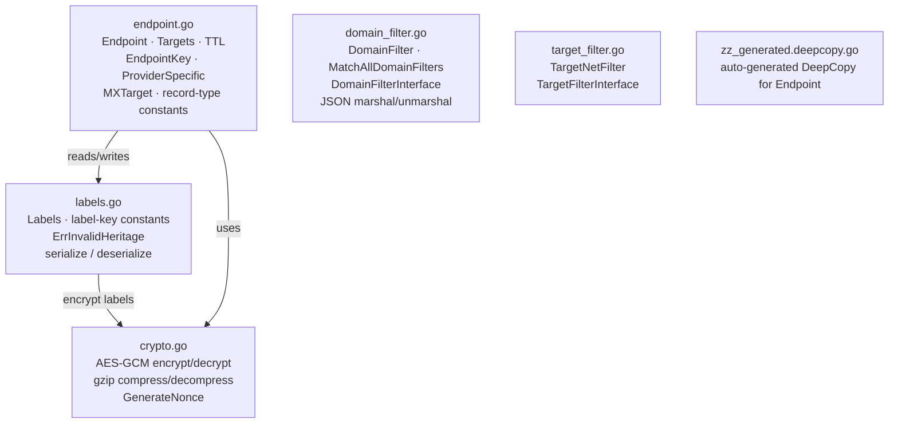

# CLAUDE.md

This file provides guidance to Claude Code (claude.ai/code) when working with code in this repository.

## Section 1 — Local Setup, Build & Startup

This package has no `main` entry point but has an independent test suite.

**Prerequisites:** Go toolchain at the version specified in the root `go.mod` (currently `go 1.25`).

```bash
# Compile-check the package
go build sigs.k8s.io/external-dns/endpoint

# Run all tests in this package
go test ./endpoint/...

# Run a single named test
go test -run TestNewEndpoint ./endpoint/...

# Verbose test output
go test -v ./endpoint/...

# Regenerate zz_generated.deepcopy.go (requires controller-gen on PATH)
controller-gen object paths=./endpoint/...
```

> `zz_generated.deepcopy.go` is auto-generated by `controller-gen`. Never edit it manually; regenerate with the command above after changing any type marked `// +kubebuilder:object:generate=true`.

**Startup Sequence:** N/A — library package, no process startup.

---

## Section 2 — Module Topology & Architecture



Depends on: `internal/idna`, `pkg/events`

---

## Section 3 — Integrations & Network Topology

### A. Core Infrastructure

| System | Protocol | Role |
|---|---|---|
| None | — | This package performs no I/O and has no stateful dependencies |

### B. Downstream Services — APIs We Consume

No direct external service integrations. All downstream calls are routed through intra-repo service modules.

### C. Exposed Interfaces — APIs We Provide

This package exposes no gRPC servers, REST controllers, or HTTP endpoints. It is a pure in-process library.

---

## Section 4 — Important Files Reference

| File Path | Category | Purpose |
|---|---|---|
| `endpoint/endpoint.go` | entrypoint | Core domain types: `Endpoint`, `Targets`, `TTL`, `EndpointKey`, `ProviderSpecific`, `MXTarget`; record-type constants; `NewEndpoint`, `NewEndpointWithTTL`, `FilterEndpointsByOwnerID`, `RemoveDuplicates`, `CheckEndpoint` |
| `endpoint/domain_filter.go` | entrypoint | `DomainFilter` (list- and regex-based include/exclude filtering), `DomainFilterInterface`, `MatchAllDomainFilters`; JSON serialization round-trip |
| `endpoint/labels.go` | entrypoint | `Labels` map type; label-key constants (`OwnerLabelKey`, `ResourceLabelKey`, `OwnedRecordLabelKey`, `AWSSDDescriptionLabel`); TXT-record serialization format; optional AES-GCM encryption path |
| `endpoint/target_filter.go` | entrypoint | `TargetNetFilter` (CIDR-based IP target inclusion/exclusion), `TargetFilterInterface` |
| `endpoint/crypto.go` | entrypoint | AES-GCM encryption + gzip compression used for TXT-record label storage; `EncryptText`, `DecryptText`, `GenerateNonce` |
| `endpoint/zz_generated.deepcopy.go` | build | Auto-generated `DeepCopyInto` / `DeepCopy` for `Endpoint`; produced by `controller-gen` |
| `endpoint/endpoint_test.go` | test-config | Tests for `Endpoint` construction, `Targets` comparison, provider-specific property CRUD, owner filtering, deduplication |
| `endpoint/domain_filter_test.go` | test-config | Tests for list-mode and regex-mode `DomainFilter`, IDNA normalization, JSON round-trips |
| `endpoint/labels_test.go` | test-config | Tests for `Labels` serialization/deserialization, AES-GCM encryption round-trips (uses `testify/suite`) |
| `endpoint/target_filter_test.go` | test-config | Tests for CIDR-based `TargetNetFilter` include/exclude logic |
| `endpoint/crypto_test.go` | test-config | Tests for `EncryptText`/`DecryptText` correctness, nonce length, faulty-reader error paths |

---

## Section 5 — Maintenance

| Field | Value |
|---|---|
| Last Updated | 2026-05-19 |
| Project Version | Not declared (Go module; no `gradle.properties`, `build.gradle.kts`, or `package.json`) |
| Maintained By | Unknown |

---

## Key Architectural Rules

These are non-obvious invariants that affect correctness across the codebase.

**`Endpoint` field persistence contract**
`Labels` are serialized into DNS TXT records and persisted in the registry. `ProviderSpecific` entries are **never** persisted — they exist only in memory during a single sync cycle. `refObject` is excluded from JSON (`json:"-"`) and exists solely to link a DNS record back to its originating Kubernetes object during event emission.

**Trailing-dot trimming exception**
`NewEndpointWithTTL` trims trailing dots from target values for all record types **except** `TXT` and `NAPTR`. TXT records hold arbitrary text (including dots); NAPTR values follow a different convention. Callers constructing targets for these types must not pre-strip trailing dots.

**DNS label length enforcement**
`NewEndpointWithTTL` validates that every label in `dnsName` is ≤ 63 characters (RFC 1123). A violation causes the function to log an error and return `nil`. Callers must nil-check the result.

**Deduplication key excludes `Targets`**
`RemoveDuplicates` keys on `EndpointKey{DNSName, RecordType, SetIdentifier}`. Two `Endpoint` values with identical keys but different `Targets` are still considered duplicates; only the first one is kept.

**Encryption nonce reuse for idempotency**
`Labels.Serialize` stores the encryption nonce inside `Labels[txtEncryptionNonce]`. On re-serialization of an already-decrypted label map, the same nonce is reused, producing the same ciphertext. This prevents spurious TXT record updates when nothing has actually changed.

**`DomainFilter.Match` on nil or empty**
A `nil` `DomainFilter` pointer always returns `true`. An empty (zero-value) `DomainFilter{}` also returns `true` for any domain. Regex mode (non-nil `regex` field) takes precedence over list mode — both cannot be active simultaneously; `UnmarshalJSON` returns an error if both are supplied.

**`Targets.Same` normalizes IPv6**
Comparison is case-insensitive and normalizes IPv6 addresses through `netip.ParseAddr`, so `::1` and `::0001` are considered equal.

**`Targets.IsLess` IP-over-FQDN preference**
When comparing a valid IP address against a non-IP string, the IP is always considered "less". This prevents lexicographic quirks (e.g., `1-2-3-4.example.com` sorting before `1.2.3.4`) from influencing conflict resolution in the plan layer.
