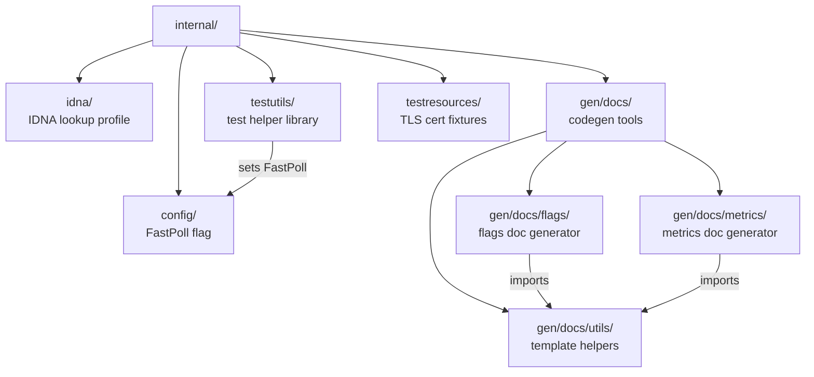

# CLAUDE.md — `internal/`

Internal library packages and code-generation tools for the `sigs.k8s.io/external-dns` repository. No server process; no HTTP/gRPC exposure.

---

## Section 1 — Local Setup, Build & Startup

This module has no standalone server entry point. The `gen/docs/flags` and `gen/docs/metrics` sub-packages are `package main` programs invoked via `go run`. All other packages (`config`, `idna`, `testutils`) are libraries compiled as part of the parent project.

**Prerequisites:** Go 1.25 (declared in root `go.mod`). No external services required.

```bash
# Run all tests for this package tree (from repo root)
go test ./internal/...

# Run tests in a single package
go test ./internal/testutils/ -run TestSameEndpoints

# Regenerate docs/flags.md (run from repo root)
go run internal/gen/docs/flags/main.go
# or via make:
make generate-flags-documentation

# Regenerate docs/monitoring/metrics.md (run from repo root)
go run internal/gen/docs/metrics/main.go
# or via make:
make generate-metrics-documentation
```

> **Generated output locations:** `docs/flags.md` and `docs/monitoring/metrics.md` — both relative to the repository root. Do not edit these files by hand; they carry a `<!-- THIS FILE MUST NOT BE EDITED BY HAND -->` guard comment.
>
> `gen/docs/metrics/main.go` uses `unsafe.Pointer` to inspect the Prometheus default registerer's internal map. This is intentional and safe for a documentation generator that is never deployed.
>
> `testutils/init.go` has a package-level `init()` that sets `config.FastPoll = true` and discards log output unless `DEBUG` is set. Any test file that imports `testutils` inherits this side effect.

**No startup sequence** — this directory contains no server or long-running process.

---

## Section 2 — Module Topology & Architecture



**Intra-module dependencies:**
- `testutils` → `config` (sets `FastPoll = true` in `init()`)
- `gen/docs/flags` → `gen/docs/utils`
- `gen/docs/metrics` → `gen/docs/utils`

**Depends on (sibling modules — treated as opaque):** `endpoint`, `pkg/apis/externaldns`, `pkg/metrics`, `controller`, `provider`, `provider/webhook`

---

## Section 3 — Integrations & Network Topology *(MCP-parseable — strict tables required)*

#### A. Core Infrastructure

| System | Protocol | Role |
|---|---|---|
| None | — | This module makes no stateful infrastructure calls. |

#### B. Downstream Services — APIs We Consume

No direct external service integrations. All downstream calls are routed through intra-repo service modules.

#### C. Exposed Interfaces — APIs We Provide

This module exposes no HTTP, gRPC, or other network interfaces.

---

## Section 4 — Important Files Reference

| File Path | Category | Purpose |
|---|---|---|
| `internal/config/config.go` | `config` | Declares `FastPoll bool`; set to `true` by `testutils` init to speed up poll-based tests |
| `internal/idna/idna.go` | `entrypoint` | Exports a shared `golang.org/x/net/idna` profile configured for lookup-mode, transitional, and non-strict domain name validation |
| `internal/testutils/init.go` | `test-config` | Package `init()` — sets `config.FastPoll = true`, suppresses log output unless `DEBUG` env var is set |
| `internal/testutils/endpoint.go` | `test-config` | Order-independent endpoint comparison helpers: `SameEndpoint`, `SameEndpoints`, `SameEndpointLabels`, `SamePlanChanges`, `GenerateTestEndpointsByType` |
| `internal/testutils/mock_source.go` | `test-config` | `MockSource` — testify mock implementing the endpoint-source interface, fires event handler every 5 s via goroutine |
| `internal/testutils/log.go` | `test-config` | Logrus capture helpers: `LogsUnderTestWithLogLevel`, `TestHelperLogContains`, `TestHelperLogNotContains`, `TestHelperLogContainsWithLogLevel` |
| `internal/testutils/metrics.go` | `test-config` | Prometheus gauge verification helpers: `TestHelperVerifyMetricsGaugeVectorWithLabels`, `TestHelperVerifyMetricsGaugeVectorWithLabelsFunc` |
| `internal/testutils/env.go` | `test-config` | `TestHelperEnvSetter` — sets environment variables for a test via `t.Setenv` (auto-restored on cleanup) |
| `internal/testutils/helpers.go` | `test-config` | `ToPtr[T any]` — generic helper returning a pointer to any value |
| `internal/gen/docs/flags/main.go` | `entrypoint` | Codegen binary: introspects registered CLI flags and renders `docs/flags.md` via `templates/flags.gotpl` |
| `internal/gen/docs/metrics/main.go` | `entrypoint` | Codegen binary: introspects registered Prometheus metrics and renders `docs/monitoring/metrics.md` via `templates/metrics.gotpl`; uses `unsafe` to read default registerer internals |
| `internal/gen/docs/utils/utils.go` | `build` | Shared template utilities for codegen: `WriteToFile`, `FuncMap` (provides `backtick` and `capitalize` template functions) |
| `internal/gen/docs/flags/templates/flags.gotpl` | `spec` | Go text template that renders the CLI flags Markdown table |
| `internal/gen/docs/metrics/templates/metrics.gotpl` | `spec` | Go text template that renders the Prometheus metrics Markdown table including Go runtime metrics |
| `internal/testresources/ca.pem` | `test-config` | Test CA certificate for TLS-based tests |
| `internal/testresources/client-cert.pem` | `test-config` | Test client certificate for TLS-based tests |
| `internal/testresources/client-cert-key.pem` | `test-config` | Test client private key for TLS-based tests |

---

## Section 5 — Maintenance

| Field | Value |
|---|---|
| Last Updated | 2026-05-19 |
| Project Version | N/A (Go module `sigs.k8s.io/external-dns`; no version field in `go.mod`) |
| Maintained By | Unknown |
