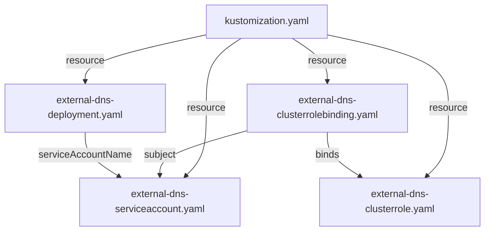

# CLAUDE.md — `kustomize/`

This module is a self-contained Kustomize overlay that deploys the `external-dns` workload and its required RBAC resources to a Kubernetes cluster. It has no application source code, no build system, and no runtime outside of Kubernetes.

---

## Section 1 — Local Setup, Build & Startup

This module is built and run as part of the parent project. See the root `CLAUDE.md` for repository-wide build and run instructions.

To apply this overlay directly:

```bash
# Render manifests without applying
kubectl kustomize kustomize/

# Apply to the current cluster context
kubectl apply -k kustomize/

# Tear down
kubectl delete -k kustomize/
```

> The image tag is managed in `kustomization.yaml` under the `images` stanza. Bump only that field to upgrade the container image — do not edit the `image:` field in `external-dns-deployment.yaml` directly, as `kustomize` overwrites it at apply time.

---

## Section 2 — Module Topology & Architecture



This module has no sibling module dependencies within the repository. It is a standalone Kubernetes manifest bundle.

---

## Section 3 — Integrations & Network Topology

#### A. Core Infrastructure

| System | Protocol | Role |
|---|---|---|
| Kubernetes API Server | HTTPS / in-cluster REST | The `external-dns` pod reads `Service`, `Ingress`, `EndpointSlice`, and `Node` resources via watch/list to determine desired DNS state |
| Kubernetes RBAC | in-cluster | `ClusterRole` `external-dns` grants read-only access to pods, services, endpoint slices, ingresses (both `extensions` and `networking.k8s.io` groups), and nodes; bound to `ServiceAccount` `external-dns` in namespace `default` via `ClusterRoleBinding` `external-dns-viewer` |

#### B. Downstream Services — APIs We Consume

No direct external service integrations. All downstream calls are routed through the `external-dns` container process itself (configured at runtime via container args); no client code lives in this module.

#### C. Exposed Interfaces — APIs We Provide

This module does not expose any APIs. It deploys a consumer-only workload that synchronises Kubernetes resource state to an external DNS provider. No gRPC servers, REST controllers, or HTTP endpoints are defined here.

---

## Section 4 — Important Files Reference

| File Path | Category | Purpose |
|---|---|---|
| `kustomize/kustomization.yaml` | `config` | Kustomize entry point; declares the four resources and pins the container image tag |
| `kustomize/external-dns-deployment.yaml` | `config` | `Deployment` manifest; sets `Recreate` rollout strategy, specifies DNS sources (`service`, `ingress`) and registry type (`txt`) |
| `kustomize/external-dns-serviceaccount.yaml` | `config` | `ServiceAccount` `external-dns` used by the pod for in-cluster identity |
| `kustomize/external-dns-clusterrole.yaml` | `config` | `ClusterRole` defining read-only RBAC permissions required by the workload |
| `kustomize/external-dns-clusterrolebinding.yaml` | `config` | Binds `ClusterRole` `external-dns` to `ServiceAccount` `external-dns` in namespace `default` |
| `kustomize/OWNERS` | `build` | Kubernetes-style OWNERS file labelling this directory under the `kustomize` area |

---

## Section 5 — Maintenance

| Field | Value |
|---|---|
| Last Updated | 2026-05-19 |
| Project Version | v0.19.0 (container image tag in `kustomization.yaml`) |
| Maintained By | Unknown |
