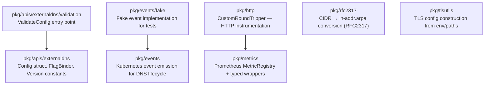

# CLAUDE.md

This file provides guidance to Claude Code (claude.ai/code) when working with code in this repository.

## Section 1 — Local Setup, Build & Startup

This module is built and run as part of the parent project. See the root `CLAUDE.md` for repository-wide build and run instructions.

The test suite within `pkg/` can be run independently:

```bash
# Run all tests in pkg/ with race detection
go test -race ./pkg/...

# Run a single package's tests
go test -race ./pkg/apis/externaldns/...
go test -race ./pkg/metrics/...

# Run a single test by name
go test -race -run TestValidateConfig ./pkg/apis/externaldns/validation/...

# Run tests with coverage
go test -cover -coverprofile=cover.out -v ./pkg/...
go tool cover -html=cover.out
```

> **Version injection:** `pkg/apis/externaldns.Version` and `pkg/apis/externaldns.GitCommit` are empty strings at test time; they are only populated via `LDFLAGS` during the root-level binary build (`make build`).

---

## Section 2 — Module Topology & Architecture



Depends on sibling modules: `endpoint`, `source` (specifically `source/annotations`).

### Architectural rules

- **`pkg/apis/externaldns`** is the authoritative home for the global `Config` struct. All 100+ configuration fields live in `types.go`. The `binders.go` file abstracts CLI flag registration across two backends (Kingpin v2 and Cobra) using the `FlagBinder` interface — never register flags directly against either library outside this package.
- **`pkg/metrics`** uses a **global `MetricRegistry` singleton** initialised in `init()` functions. All consumer packages call `RegisterMetric(...)` once at startup; re-registering the same metric name panics. All `GaugeVecMetric.SetWithLabels` calls lowercase every label value before writing to Prometheus — callers must not pre-lowercase.
- **`pkg/http`** wraps any `http.RoundTripper` with `CustomRoundTripper` to emit request-duration summaries through `pkg/metrics`. The instrumented client is the expected way to make outbound HTTP calls elsewhere in the binary.
- **`pkg/events`** emits `eventsv1` Kubernetes events (not the older `corev1` events). Event reason strings are sanitised for RFC 1123 compliance before emission; the sanitisation regex is `[^a-z0-9.\-]`. Dry-run mode suppresses emission without changing the API.
- **`pkg/rfc2317`** is a pure conversion utility — no state, no I/O. `CidrToInAddr` converts a CIDR string (e.g. `10.20.30.0/25`) to its delegated reverse-lookup name (`0/25.30.20.10.in-addr.arpa`). PTR record logic elsewhere in the binary routes through this package.
- **`pkg/tlsutils`** is also stateless. `NewTLSConfig` returns a `*tls.Config` from explicit paths; `CreateTLSConfig(prefix)` loads the same values from environment variables prefixed by `prefix`.

---

## Section 3 — Integrations & Network Topology

### A. Core Infrastructure

| System | Protocol | Role |
|---|---|---|
| Prometheus | Pull (HTTP `/metrics`) | Metrics emitted by `pkg/metrics`; scraped externally |
| Kubernetes Events API | HTTPS (client-go) | `pkg/events` posts `eventsv1.Event` objects to the cluster |

### B. Downstream Services — APIs We Consume

No direct external service integrations. All downstream calls are routed through intra-repo service modules.

### C. Exposed Interfaces — APIs We Provide

This module is a library package; it exposes no gRPC servers, REST controllers, or HTTP listeners of its own. All public surfaces are Go package APIs consumed by the root binary and other intra-repo packages.

---

## Section 4 — Important Files Reference

| File Path | Category | Purpose |
|---|---|---|
| `pkg/apis/externaldns/types.go` | entrypoint | Defines the global `Config` struct with every configurable field; `ParseFlags` wires the struct to a CLI |
| `pkg/apis/externaldns/binders.go` | entrypoint | `FlagBinder` interface + `KingpinBinder`/`CobraBinder` implementations |
| `pkg/apis/externaldns/version.go` | entrypoint | `Version` and `GitCommit` package-level vars populated by LDFLAGS at build time |
| `pkg/apis/externaldns/validation/validation.go` | entrypoint | `ValidateConfig` — validates required fields, mutual-exclusions, and provider-specific constraints |
| `pkg/events/types.go` | entrypoint | `Action`/`Reason`/`EventType` constants and `Event` struct; RFC 1123 sanitisation logic |
| `pkg/events/controller.go` | entrypoint | Event controller that posts events to the Kubernetes API |
| `pkg/events/fake/fake.go` | test-config | In-memory fake event emitter used in unit tests across the repo |
| `pkg/metrics/metrics.go` | entrypoint | Global `MetricRegistry`; `RegisterMetric` and build-info gauge initialisation |
| `pkg/metrics/models.go` | entrypoint | `IMetric` interface; typed wrappers: `GaugeMetric`, `CounterMetric`, `CounterVecMetric`, `GaugeVecMetric`, `GaugeFuncMetric`, `SummaryVecMetric` |
| `pkg/metrics/labels.go` | entrypoint | Label name constants (`LabelScheme`, `LabelHost`, `LabelPath`, `LabelMethod`, `LabelStatus`) |
| `pkg/http/http.go` | entrypoint | `CustomRoundTripper` — wraps `http.RoundTripper` to record request-duration summaries |
| `pkg/rfc2317/arpa.go` | entrypoint | `CidrToInAddr(cidr string) string` — CIDR to delegated reverse-DNS name |
| `pkg/tlsutils/tlsconfig.go` | entrypoint | `NewTLSConfig` and `CreateTLSConfig` — build `*tls.Config` from paths or env vars |

---

## Section 5 — Maintenance

| Field | Value |
|---|---|
| Last Updated | 2026-05-19 |
| Project Version | determined at build time via `git describe --tags` (see `Makefile` `VERSION` variable) |
| Maintained By | Unknown |
