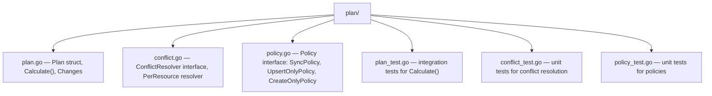

# CLAUDE.md — `plan` package

## Section 1 — Local Setup, Build & Startup

This module is built and run as part of the parent project. See the root `CLAUDE.md` for repository-wide build and run instructions.

The `plan` package has an independent test suite runnable in isolation:

```bash
# Run all tests in this package
go test sigs.k8s.io/external-dns/plan/...

# Run a single test by name
go test sigs.k8s.io/external-dns/plan/... -run TestPlanCalculate

# Run with verbose output
go test -v sigs.k8s.io/external-dns/plan/...
```

---

## Section 2 — Module Topology & Architecture



Depends on: `endpoint`, `internal/idna`

---

## Section 3 — Integrations & Network Topology

#### A. Core Infrastructure

| System | Protocol | Role |
|---|---|---|
| None | — | This package is a pure in-process computation library with no stateful infrastructure dependencies |

#### B. Downstream Services — APIs We Consume

No direct external service integrations. All downstream calls are routed through intra-repo service modules.

#### C. Exposed Interfaces — APIs We Provide

This package exposes no network interfaces. It is a library consumed in-process by the controller.

> Spec: `plan/plan.go`, `plan/conflict.go`, `plan/policy.go`

---

## Section 4 — Important Files Reference

| File Path | Category | Purpose |
|---|---|---|
| `plan/plan.go` | `entrypoint` | `Plan` struct and `Calculate()` — diffs current vs desired `endpoint.Endpoint` slices and produces a `Changes` struct (Create/UpdateOld/UpdateNew/Delete lists); also contains `filterRecordsForPlan()`, `normalizeDNSName()`, `IsManagedRecord()` |
| `plan/conflict.go` | `entrypoint` | `ConflictResolver` interface and `PerResource` implementation — arbitrates when multiple Kubernetes resources compete for the same DNS name; enforces RFC 1034 §3.6.2 CNAME exclusivity |
| `plan/policy.go` | `entrypoint` | `Policy` interface with three implementations: `SyncPolicy` (full sync), `UpsertOnlyPolicy` (no deletes), `CreateOnlyPolicy` (no updates or deletes) — gates which `Changes` entries are emitted |
| `plan/plan_test.go` | `test-config` | Comprehensive tests for `Calculate()` covering multi-resource ownership, TTL drift, provider-specific properties, domain filtering, and owner ID migration |
| `plan/conflict_test.go` | `test-config` | Unit tests for `PerResource` resolver covering CNAME/A conflict resolution and lexicographic winner selection |
| `plan/policy_test.go` | `test-config` | Unit tests verifying that each `Policy` implementation filters `Changes` correctly |
| `plan/OWNERS` | `build` | Kubernetes OWNERS file — designates approvers and reviewers for this package |

---

## Section 5 — Maintenance

| Field | Value |
|---|---|
| Last Updated | 2026-05-19 |
| Project Version | b3273845 (no semver tag; version derived from `git describe`) |
| Maintained By | Unknown |
