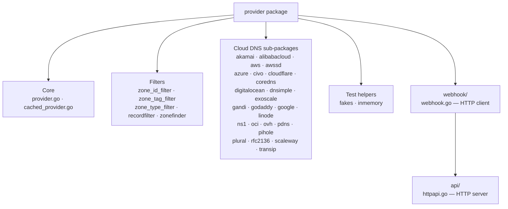

# CLAUDE.md — `provider/`

## Section 1 — Local Setup, Build & Startup

This module is built and run as part of the parent project. See the root `CLAUDE.md` for repository-wide build and run instructions.

---

## Section 2 — Module Topology & Architecture

Depends on: `endpoint`, `plan`, `pkg/metrics`

---

## Section 3 — Integrations & Network Topology

### A. Core Infrastructure

| System | Protocol | Role |
|---|---|---|
| None | — | This package is a pure Go library with no stateful infrastructure dependencies of its own. |

### B. Downstream Services — APIs We Consume

Each sub-package is an adapter to a distinct external cloud DNS service. All external calls originate from within the named sub-package directory.

#### AWS Route 53 — HTTPS/REST
Amazon Route 53 DNS service and associated AWS APIs.
> Integration: `provider/aws/aws.go`, `provider/aws/config.go`

#### AWS Service Discovery — HTTPS/REST
AWS Cloud Map service discovery registry.
> Integration: `provider/awssd/aws_sd.go`

#### Azure DNS / Azure Private DNS — HTTPS/REST
Microsoft Azure public and private DNS zones.
> Integration: `provider/azure/azure.go`, `provider/azure/azure_private_dns.go`, `provider/azure/config.go`

#### Google Cloud DNS — HTTPS/REST
Google Cloud DNS managed zones.
> Integration: `provider/google/google.go`

#### Cloudflare DNS — HTTPS/REST
Cloudflare DNS zones including regional DNS support.
> Integration: `provider/cloudflare/cloudflare.go`, `provider/cloudflare/cloudflare_regional.go`

#### DigitalOcean DNS — HTTPS/REST
DigitalOcean managed DNS records.
> Integration: `provider/digitalocean/digital_ocean.go`

#### Akamai Edge DNS — HTTPS/REST
Akamai Edge DNS via the OpenEdgeGrid API.
> Integration: `provider/akamai/akamai.go`

#### Alibaba Cloud DNS — HTTPS/REST
Alibaba Cloud DNS service.
> Integration: `provider/alibabacloud/alibaba_cloud.go`

#### Civo DNS — HTTPS/REST
Civo cloud DNS.
> Integration: `provider/civo/civo.go`

#### CoreDNS (etcd backend) — gRPC/etcd
CoreDNS using the etcd backend for DNS record storage.
> Integration: `provider/coredns/coredns.go`

#### DNSimple — HTTPS/REST
DNSimple DNS hosting.
> Integration: `provider/dnsimple/dnsimple.go`

#### Exoscale DNS — HTTPS/REST
Exoscale cloud DNS service.
> Integration: `provider/exoscale/exoscale.go`

#### Gandi LiveDNS — HTTPS/REST
Gandi LiveDNS API.
> Integration: `provider/gandi/gandi.go`, `provider/gandi/client.go`

#### GoDaddy DNS — HTTPS/REST
GoDaddy domain DNS management API.
> Integration: `provider/godaddy/godaddy.go`, `provider/godaddy/client.go`

#### Linode DNS — HTTPS/REST
Linode DNS manager.
> Integration: `provider/linode/linode.go`

#### NS1 DNS — HTTPS/REST
NS1 managed DNS platform.
> Integration: `provider/ns1/ns1.go`

#### Oracle Cloud Infrastructure (OCI) DNS — HTTPS/REST
OCI DNS zones.
> Integration: `provider/oci/oci.go`

#### OVH DNS — HTTPS/REST
OVH DNS API.
> Integration: `provider/ovh/ovh.go`

#### PowerDNS — HTTPS/REST
PowerDNS Authoritative Server API.
> Integration: `provider/pdns/pdns.go`

#### Pi-hole DNS — HTTPS/REST (v5 and v6)
Pi-hole local DNS with support for both API v5 and v6.
> Integration: `provider/pihole/pihole.go`, `provider/pihole/client.go`, `provider/pihole/clientV6.go`

#### Plural DNS — HTTPS/GraphQL
Plural platform DNS via GraphQL API.
> Integration: `provider/plural/plural.go`, `provider/plural/client.go`

#### RFC 2136 DDNS — DNS/UDP+TCP
Dynamic DNS updates over the RFC 2136 protocol using `miekg/dns`.
> Integration: `provider/rfc2136/rfc2136.go`

#### Scaleway DNS — HTTPS/REST
Scaleway DNS zones.
> Integration: `provider/scaleway/scaleway.go`

#### TransIP DNS — HTTPS/REST
TransIP domain DNS management.
> Integration: `provider/transip/transip.go`

#### Webhook Remote Provider — HTTP/REST
An arbitrary external DNS backend reachable via the webhook HTTP API contract. The `webhook/webhook.go` client connects to a user-supplied URL, negotiates the media type `application/external.dns.webhook+json;version=1`, and proxies all `Provider` method calls. HTTP 5xx responses are wrapped as `SoftError` and retried up to 5 times with exponential backoff.
> Integration: `provider/webhook/webhook.go`

### C. Exposed Interfaces — APIs We Provide

#### `WebhookServer` (`provider.Provider` wrapper)
HTTP server that exposes any `Provider` implementation over the webhook HTTP API contract, enabling out-of-tree DNS backends to integrate as first-class providers.
> Spec: `provider/webhook/api/httpapi.go`

| Path | Description |
|---|---|
| `GET /` | Negotiation — returns serialized `DomainFilter` with media type `application/external.dns.webhook+json;version=1` |
| `GET /records` | Returns current DNS records as JSON-encoded `[]*endpoint.Endpoint` |
| `POST /records` | Applies a `plan.Changes` payload; returns `204 No Content` on success |
| `POST /adjustendpoints` | Canonicalizes a slice of `*endpoint.Endpoint`; returns the adjusted list |

---

## Section 4 — Important Files Reference

| File Path | Category | Purpose |
|---|---|---|
| `provider/provider.go` | entrypoint | Defines the `Provider` interface, `BaseProvider`, `SoftError`, `EnsureTrailingDot`, `Difference`, and `RecordsContextKey` |
| `provider/cached_provider.go` | entrypoint | `CachedProvider` decorator — wraps any `Provider` with time-based record caching and Prometheus metrics |
| `provider/recordfilter.go` | entrypoint | `SupportedRecordType` — allowlist for A, AAAA, CNAME, SRV, TXT, NS |
| `provider/zonefinder.go` | entrypoint | `ZoneFinder` — matches hostnames to zones with IDNA Unicode and underscore-label support |
| `provider/zone_id_filter.go` | entrypoint | `ZoneIDFilter` — filters zones by exact ID or suffix match |
| `provider/zone_tag_filter.go` | entrypoint | `ZoneTagFilter` — filters zones by `key=value` tag pairs |
| `provider/zone_type_filter.go` | entrypoint | `ZoneTypeFilter` — filters zones by public/private classification (Route 53–oriented) |
| `provider/webhook/webhook.go` | entrypoint | `WebhookProvider` HTTP client — proxies `Provider` calls to a remote server with retry logic |
| `provider/webhook/api/httpapi.go` | entrypoint | `WebhookServer` + `StartHTTPApi` — HTTP server exposing any `Provider` via the webhook API contract |
| `provider/fakes/provider.go` | test-config | `MockProvider` — configurable fake `Provider` for unit tests |
| `provider/inmemory/inmemory.go` | test-config | In-memory `Provider` implementation used in integration tests |
| `provider/aws/aws.go` | entrypoint | AWS Route 53 provider implementation |
| `provider/aws/config.go` | config | AWS provider configuration loading |
| `provider/aws/fixtures/160-plus-zones.yaml` | test-config | YAML fixture with 160+ Route 53 zone definitions and tag data for pagination tests |
| `provider/azure/azure.go` | entrypoint | Azure public DNS provider implementation |
| `provider/azure/azure_private_dns.go` | entrypoint | Azure private DNS zones provider implementation |
| `provider/azure/config.go` | config | Azure provider configuration loading |
| `provider/azure/fixtures/config_test.json` | test-config | JSON fixture for Azure auth configuration in tests |
| `provider/cloudflare/cloudflare.go` | entrypoint | Cloudflare DNS provider implementation |
| `provider/cloudflare/cloudflare_regional.go` | entrypoint | Cloudflare regional DNS extension |
| `provider/cloudflare/pagination.go` | entrypoint | Pagination helper for Cloudflare API list responses |
| `provider/pihole/clientV6.go` | entrypoint | Pi-hole API v6 client implementation |

---

## Section 5 — Maintenance

| Field | Value |
|---|---|
| Last Updated | 2026-05-19 |
| Project Version | N/A (Go module `sigs.k8s.io/external-dns`; versioned via git tags — no `gradle.properties`, `build.gradle.kts`, or `package.json` present) |
| Maintained By | Unknown |
