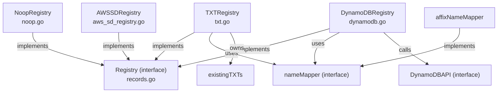

# CLAUDE.md

This file provides guidance to Claude Code (claude.ai/code) when working with code in this repository.

## Section 1 — Local Setup, Build & Startup

This module is built and run as part of the parent project. See the root `CLAUDE.md` for repository-wide build and run instructions.

Tests for this package can be run in isolation from the repository root:

```bash
# Run all registry tests
go test -race ./registry/...

# Run a single top-level test
go test -race -run TestTXTRegistry ./registry/...

# Run a specific subtest
go test -race -run TestTXTRegistry/TestRecords ./registry/...

# Run with coverage
go test -race -coverprofile=cover.out ./registry/... && go tool cover -html=cover.out
```

---

## Section 2 — Module Topology & Architecture



**Depends on:** `endpoint`, `plan`, `provider`

### Key architectural rules

- `Records()` must always be called before `ApplyChanges()` in a reconciliation cycle. `TXTRegistry` relies on this to populate `existingTXTs` (used to skip re-creating pre-existing TXT records) and resets it at the start of every `Records()` call.
- All registry implementations accept a `provider.Provider` at construction time and delegate actual DNS mutations to it. The registry layer is responsible only for ownership bookkeeping.
- `ApplyChanges()` filters `UpdateNew`, `UpdateOld`, and `Delete` by `ownerID` before forwarding to the provider, but passes `Create` through unfiltered (new records are assumed unclaimed).
- When `cacheInterval > 0`, `TXTRegistry` and `DynamoDBRegistry` maintain an in-memory slice of endpoints and inject `provider.RecordsContextKey = nil` into the context passed to `provider.ApplyChanges` to prevent the provider from using its own cache on top.
- `oldOwnerID` in `TXTRegistry` enables live owner-ID migration: endpoints whose TXT records carry the old owner ID are transparently re-labelled with the current `ownerID` during `Records()` and will be force-updated on the next `ApplyChanges()`.

### TXTRegistry — name-mapping details

- `affixNameMapper` transforms between an endpoint DNS name and the corresponding TXT record name using a prefix or suffix (mutually exclusive).
- The template token `%{record_type}` in the prefix/suffix is expanded per record type (e.g. `"owner-%{record_type}-"` → `"owner-a-"` for A records).
- Without `%{record_type}`, the record type is prepended to the first DNS label: `a-api.example.com` for an A record at `api.example.com`.
- Wildcard DNS entries (`*.example.com`) produce invalid TXT names by default; `wildcardReplacement` substitutes the `*` with a safe string.
- AWS Alias records (A records with provider-specific property `alias=true`) are encoded as record type `cname` in TXT names to match the pre-existing behaviour.

### DynamoDBRegistry — table schema and batching

- Table must have a single hash key `k` of type `S` with no range key.
- Each item stores: `k` (`{dnsName}#{recordType}#{setIdentifier}`), `o` (owner string), `l` (labels map).
- `ApplyChanges()` uses PartiQL `INSERT`/`UPDATE`/`DELETE` via `BatchExecuteStatement` in chunks of 25 (AWS limit). A `DuplicateItem` error on `INSERT` means a competing owner claimed the record; that endpoint is silently dropped from `Create`.
- Migration from `TXTRegistry` format: on first sync, if a TXT record with a recognisable heritage label exists, `DynamoDBRegistry` copies the labels into DynamoDB, marks the endpoint with `dynamodb/needs-migration`, and on the next `ApplyChanges()` inserts a fresh DynamoDB row and invalidates the records cache so the old TXT record is cleaned up on the following sync.
- Orphaned DynamoDB labels (owned by this instance but no matching DNS record) are collected during `Records()` and deleted in the second `BatchExecuteStatement` pass at the end of `ApplyChanges()`.

### AWSSDRegistry — ownership via description field

- Ownership is stored as a serialised label string in the `AWSSDDescriptionLabel` endpoint label. The provider is expected to read and write this field from/to the AWS Service Discovery service description.
- No caching: every `Records()` call fetches live data from the provider.

---

## Section 3 — Integrations & Network Topology

### A. Core Infrastructure

| System | Protocol | Role |
|---|---|---|
| AWS DynamoDB | AWS SDK v2 (`DescribeTable`, `Scan`, `BatchExecuteStatement` via PartiQL) | Persistent ownership label store for `DynamoDBRegistry`; requires a table with hash key `k` (string), no range key, and attributes `o` (owner) and `l` (labels map) |

### B. Downstream Services — APIs We Consume

No direct external service integrations. All downstream calls are routed through intra-repo service modules.

> Note: `DynamoDBRegistry` calls AWS DynamoDB through the `DynamoDBAPI` interface defined within this package (`dynamodb.go:39–44`). The concrete AWS SDK client is injected by the caller; no SDK import or network dial originates from this package itself.

### C. Exposed Interfaces — APIs We Provide

This package is a pure Go library. It exposes no HTTP, gRPC, or any other network interface. Its public surface is the `Registry` interface and the four constructor functions (`NewNoopRegistry`, `NewTXTRegistry`, `NewAWSSDRegistry`, `NewDynamoDBRegistry`).

---

## Section 4 — Important Files Reference

| File Path | Category | Purpose |
|---|---|---|
| `registry.go` | `spec` | Defines the `Registry` interface: `Records`, `ApplyChanges`, `AdjustEndpoints`, `GetDomainFilter`, `OwnerID` |
| `noop.go` | `entrypoint` | `NoopRegistry`: passthrough implementation with no ownership tracking |
| `txt.go` | `entrypoint` | `TXTRegistry`: ownership via associated DNS TXT records; contains `affixNameMapper`, `existingTXTs`, and all name-mapping logic |
| `aws_sd_registry.go` | `entrypoint` | `AWSSDRegistry`: ownership serialised into AWS Service Discovery description field |
| `dynamodb.go` | `entrypoint` | `DynamoDBRegistry`: ownership persisted in an AWS DynamoDB table; defines `DynamoDBAPI` interface and all PartiQL statement builders |
| `noop_test.go` | `test-config` | Tests for `NoopRegistry` using an in-memory provider |
| `txt_test.go` | `test-config` | Comprehensive tests for `TXTRegistry` covering cache, prefix/suffix extraction, format migration, multi-cluster, and encryption scenarios |
| `txt_encryption_test.go` | `test-config` | Dedicated AES-256 encryption/decryption tests for TXT record values |
| `txt_utils_test.go` | `test-config` | Shared test helpers: `newEndpointWithOwner`, `newEndpointWithOwnerAndLabels`, `newEndpointWithOwnerResource`, `cloneEndpointsWithOpts` |
| `aws_sd_registry_test.go` | `test-config` | Tests for `AWSSDRegistry` including description-field serialisation round-trips |
| `dynamodb_test.go` | `test-config` | Tests for `DynamoDBRegistry` with a configurable `DynamoDBStub`; covers race-condition duplicate-item handling and TXT migration |
| `OWNERS` | `build` | Kubernetes project governance: assigns `registry` label to this directory |

---

## Section 5 — Maintenance

| Field | Value |
|---|---|
| Last Updated | 2026-05-19 |
| Project Version | determined from git tags at build time (`git describe --tags --always --dirty --match "v*"`) |
| Maintained By | Unknown |
