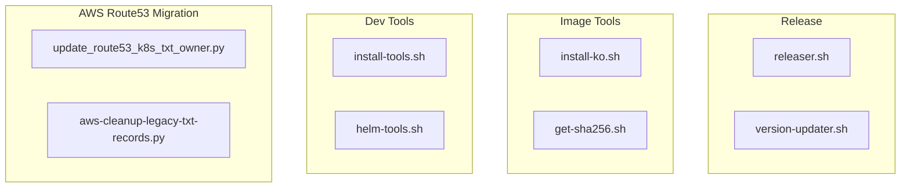

# CLAUDE.md

This file provides guidance to Claude Code (claude.ai/code) when working with code in this repository.

## Local Setup, Build & Startup

This module is built and run as part of the parent project. See the root `CLAUDE.md` for repository-wide build and run instructions.

## Module Topology & Architecture

The `scripts/` directory is a flat collection of standalone utility scripts. There is no internal package hierarchy. Scripts group into four functional areas:

No sibling module dependencies. All scripts call external tooling (`gh`, `helm`, `boto3`, `crane`, `golangci-lint`, `ko`) directly.

## Integrations & Network Topology

### A. Core Infrastructure

No stateful infrastructure (database, broker, queue) is owned by this directory.

### B. Downstream Services — APIs We Consume

#### GitHub API — REST (via `gh` CLI)
Lists merged PRs since the last release and creates GitHub releases with generated changelogs.

> Integration: `scripts/releaser.sh`

#### AWS Route53 — REST (via `boto3`)
Reads and mutates DNS TXT records within a specified hosted zone. Used by two migration scripts: one that creates missing heritage/owner TXT records, and one that batch-deletes legacy TXT records by string match.

> Integration: `scripts/update_route53_k8s_txt_owner.py`, `scripts/aws-cleanup-legacy-txt-records.py`

#### Kubernetes API — REST (via Python `kubernetes` client)
Reads `Service` and `Ingress` resources cluster-wide to determine which DNS names external-dns is expected to manage.

> Integration: `scripts/update_route53_k8s_txt_owner.py`

#### Container Registry — OCI (via `crane`)
Fetches image digests and per-architecture manifest entries from a container registry for a given image reference.

> Integration: `scripts/get-sha256.sh`

### C. Exposed Interfaces — APIs We Provide

None. Scripts are invoked as CLI tools; they do not expose servers or APIs.

## Important Files Reference

| File Path | Category | Purpose |
|---|---|---|
| `scripts/releaser.sh` | `entrypoint` | Generates changelog from merged PRs (by conventional commit prefix) and creates a GitHub release; dry-run when called with no argument |
| `scripts/version-updater.sh` | `entrypoint` | Replaces a previous release tag with a new one across `kustomize/kustomization.yaml` and all Markdown docs, then commits the result |
| `scripts/install-tools.sh` | `build` | Installs `golangci-lint` at the pinned version tracked by Renovate (`--golangci` flag) |
| `scripts/helm-tools.sh` | `build` | Helm chart maintenance toolkit: installs helm plugins (`--install`), regenerates JSON schema from `.schema.yaml` (`--schema`), validates schema has not drifted (`--diff`), lints chart (`--lint`), regenerates `README.md` via `helm-docs` (`--docs`), runs unit tests (`--helm-unittest`), renders templates to `_scratch/` (`--helm-template`) |
| `scripts/install-ko.sh` | `build` | Installs `ko` v0.17.1 (Go container image builder) if not already on `PATH` |
| `scripts/get-sha256.sh` | `entrypoint` | Prints OCI digest and per-architecture digests for a given image reference using `crane` |
| `scripts/update_route53_k8s_txt_owner.py` | `entrypoint` | One-time migration helper: compares K8s-managed hostnames against Route53 A records, then creates missing TXT heritage/owner records so external-dns can adopt them; requires editing `hosted_zone_id` and `txt_owner_id` constants before use; depends on `boto3` and `kubernetes` Python packages |
| `scripts/aws-cleanup-legacy-txt-records.py` | `entrypoint` | Batch-deletes Route53 TXT records whose value contains a specified string; defaults to dry-run unless `--run` is passed; supports `--total-items` and `--batch-delete-count` to limit blast radius; depends on `boto3` |
| `scripts/OWNERS` | `config` | Kubernetes-style OWNERS file assigning the `scripts` label to this directory |

## Maintenance

| Field | Value |
|---|---|
| Last Updated | 2026-05-19 |
| Project Version | N/A (no `gradle.properties`, `build.gradle.kts`, or `package.json` present) |
| Maintained By | Unknown |
